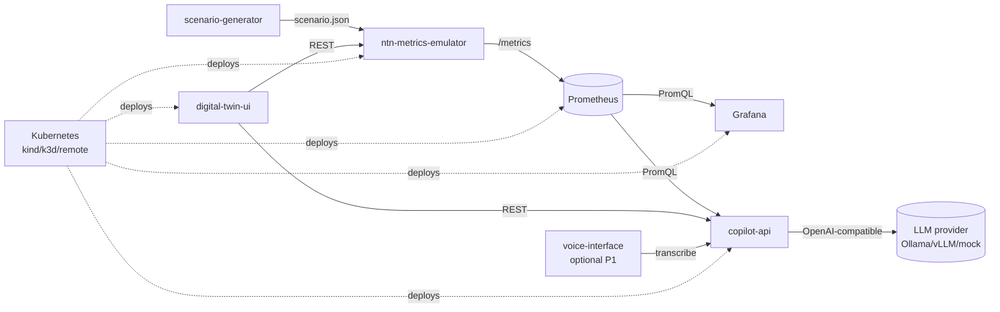
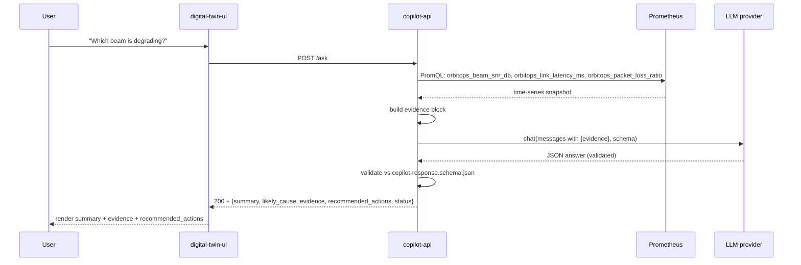
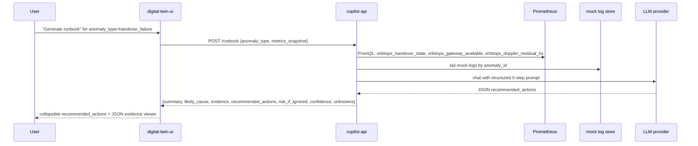

# 02 — Architecture

## High-level architecture



## Sequence — UC1 ask-flow



## Sequence — UC2 runbook-flow



## Component boundaries

| Component | 責任 | 不做 |
|---|---|---|
| scenario-generator | 產 scenario JSON、template、CLI | 不算指標；不發 HTTP 給 emulator 以外 |
| ntn-metrics-emulator | tick loop、Prometheus exposition、anomaly inject | 不接 LLM；不存盤 |
| copilot-api | RAG over metrics/logs；evidence enforcement；provider adapter | 不畫 UI；不直存原始 metric |
| digital-twin-ui | UI shell + Copilot panel + 視覺化 | 不直接用 LLM；不直接打 Prometheus（透過 API） |
| voice-interface | ASR → text，餵給 copilot | 不解釋；不打 LLM |
| Prometheus / Grafana | scrape / 儲存 / 查詢 / dashboard | 不發告警（P0） |

## Security boundary

- **網路**：所有 service 預設僅在叢集內或 docker-compose network 互通；UI 與 Grafana 走 port-forward 或 Ingress（P1）。
- **身分**：P0 不接 IdP；UI 與 API 之間僅靠 service-mesh （未啟用）；P1 加 JWT。
- **secrets**：`.env`／K8s Secret；不入 git；CI 阻擋。
- **prompt injection**：copilot-api 對所有 user-supplied 字串套 placeholder template；不直接拼接。

## LLM boundary

- 模型不可直接看到原始 user input；所有訊息透過模板：
  ```
  system: "You are an evidence-grounded NTN ops assistant. Cite metrics by name."
  user: """{question}"""
  context: {evidence_json}
  output_schema: copilot-response.schema.json
  ```
- 模型輸出必須是 JSON，伺服器端用 Pydantic 驗證；失敗 → 1 次 retry → 仍失敗 → `INSUFFICIENT_EVIDENCE`。
- 模型不持久化使用者對話。

## Simulation vs real integration boundary

| Layer | P0（simulation） | P2（real） |
|---|---|---|
| Scenario | scenario JSON template | TLE 真衛星 + Skyfield 傳播 |
| RF channel | 純函式 fake | Sionna RT v2.0.1 ray tracing |
| RAN stack | metrics emulator | OAI v2.4.0 NTN 分支 / srsRAN 25.10 |
| Core | none | Open5GS / free5GC |
| Orchestration | Kustomize + Helm | Nephio R5 + Porch + ArgoCD App-of-Apps |
| O2 IMS | stub package | 真 O-Cloud Manager |
| Visualization | CesiumJS | + Omniverse / AODT scene |

## 未來整合點（P2/P3）

1. **SDR-in-the-loop**：emulator 替換成 ZMQ-virtual radio + USRP；scenario 用 Doppler profile 餵 baseband。
2. **OAI/srsRAN NTN**：emulator 替換成 wrapper；保留 contract `metrics.schema.json`。
3. **Nephio O2 IMS**：management cluster + workload cluster；kpt package 從 stub 升級為 functional。
4. **AODT/Sionna RT**：scenario JSON → AODT scene；channel coefficients 注回 emulator。
5. **Closed-loop**：copilot 建議 → ArgoCD apply → 觀察 → 反饋。

## Data flow（concrete）

```
scenario.json ─▶ emulator (in-memory state) ─▶ /metrics ─▶ Prometheus TSDB
                                                                  │
                                                                  ▼
copilot-api ─[PromQL]─▶ Prometheus ─▶ evidence ─▶ LLM ─▶ JSON ─▶ Pydantic ─▶ UI
                                                                  │
                                                                  ▼
                                                              tests/golden/*.expected.json
```
